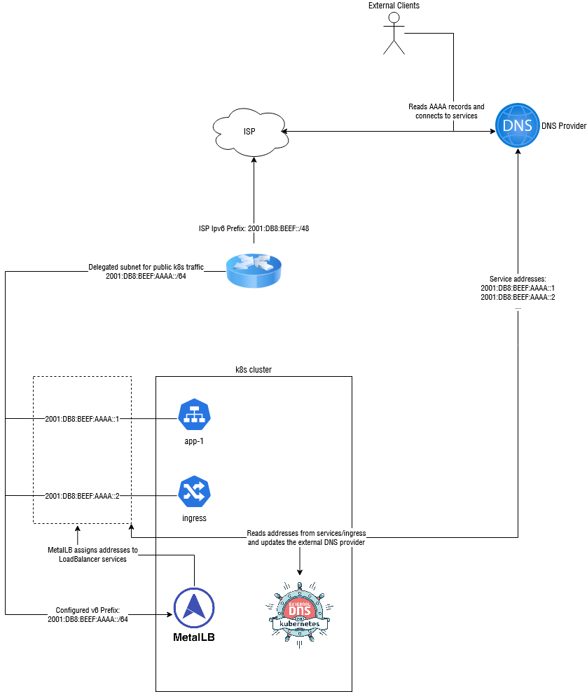
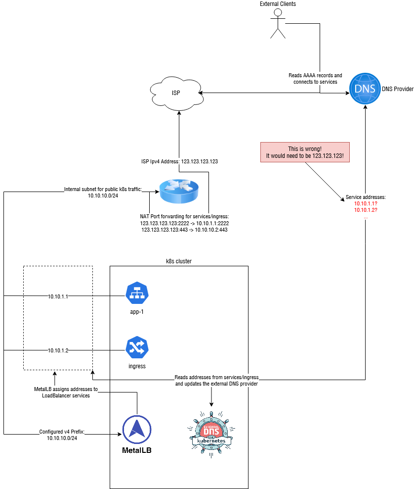

# clouddns-nat-helper

A utility to automatically generate A records for hosts behind a NAT from AAAA records in a DNS zone.

## What? Who in their right mind would need this?

This tool was written with a rather specific scenario in mind:

- You host one or more application(s)
- The application servers are reachable normally via IPv6 and have public DNS records, while IPv4 access happens through NAT
- You can set the IPv6 records automatically, but the IPv4 NAT address changes periodically and needs to be updated regularly.
- You don't want/cannot let each application update the DNS A records

So, when would this scenario ever pop up? Well, when you are hosting a dual-stack Kubernetes cluster from a residential ISP connection for example!
Most ISPs hand out a single dynamic public IPv4 address, as well as a public IPv6 prefix.

Routing the Ipv6 traffic is "easy" enough:

1. Create an Ipv6 subnet in your prefix that will contain your public k8s services
2. Use [MetalLB](https://metallb.universe.tf/) or similar to assign services addresses from that subnet
3. Use [external-dns](https://github.com/kubernetes-sigs/external-dns) to generate DNS records at an external DNS provider like Cloudflare to route traffic to your network
    - Note: At the time of writing (October 2022), external-dns doesn't actually support Ipv6 properly! Yes, really. Thankfully there are forks that work for me (see [here](https://github.com/samipsolutions/external-dns/tree/feat/ipv6-support) and [here](https://github.com/kubernetes-sigs/external-dns/pull/2461))
4. Adjust your firewall settings

Diagram of the above setup:



(Prefixes and config have been simplified slightly)

However, this falls apart with IPv4 addresses, as we don't have a public IPv4 network to assign to the k8s cluster.
We can use an internal Ipv4 network to get service behind our NAT and then configure our NAT Router to port forward to those addresses, but external-dns has no idea how to handle this situation.
It will just push the internal Ipv4 addresses into public DNS, which is of course complete nonsense.



One approach to solve this would be to write a script that gets the public IP address, then injects that into the external-dns config as a hardcoded value[^1].

Another approach (which is what this tool does) is to configure external-dns to only publish AAAA records, then look for AAAA records without an associated A record and generate them.

[^1]: Note that this requires running two versions of external-dns, one for IPv4 with the hardcoded value, and one for IPv6. It might get messy

# How it works

This tool operates in 3 basic steps:
1. It reads records from a DNS provider such as Cloudflare
2. It looks for domains that have an AAAA record, but no A records
3. It creates A records for these missing domains based on an supplied IPv4 address source (such as a static address or a hostname to lookup)

nat-helper also keeps track of domain ownership using TXT records (or potentially another registry in the future),
meaning that it *knows* which domains A records were created by it, and which ones weren't.
This also allows us to track changes, update records when they become outdated and delete A records for a owned domain when there are no more AAAA records.

# Status

If you couldn't tell from the above description, this is a hobby project for a rather specific use case.
That said, I built it with reliability, safety and extensibility in mind and it has served its purpose well.
Still, use it at your own risk. I may break things in future releases if needed.

Providers, Registries and Ipv4Sources use pluggable interfaces, so adding new ones in the future should be simple.

# Installation

## Binary

You can download linux binaries from the [releases page](https://github.com/maxhoesel/clouddns-nat-helper/releases).

Note that only the `x86_64-unknown-linux-gnu` target is tested thoroughly, the other binaries should work as well however.

## With Cargo

If you have `cargo` installed, simply run

`cargo install clouddns-nat-helper`

## Via Docker

Docker images are automatically built and pushed to the following registries:

- [DockerHub](https://hub.docker.com/r/maxhoesel/clouddns-nat-helper)
- [GitHub Packages](https://ghcr.io/maxhoesel/clouddns-nat-helper)
- [Quay.io](https://quay.io/maxhoesel/clouddns-nat-helper)

Notes:
- The `latest` tag points to this repositories master branch and **may break at any time**.
- Supported architectures: `amd64` (default), `arm64` (use tags with the `-arm64` suffix)

To pass arguments to the image, use environment variables or an environment file:


```
$ docker run --env-file ./.env maxhoesel/clouddns-nat-helper:0.1

$ cat .env
# there are more configuration options available, run with --help, check the README and see src/bin/cli/mod.rs for more details
CLOUDDNS_NAT_PROVIDER=cloudflare
CLOUDDNS_NAT_CLOUDFLARE_API_TOKEN=abc123456789

CLOUDDNS_NAT_SOURCE=hostname
CLOUDDNS_NAT_IPV4_HOSTNAME=maxhoesel.de
```
## In a kubernetes cluster

There is a helm chart available for download  [here](https://github.com/maxhoesel/clouddns-nat-helper/tree/main/helm/charts/clouddns-nat-helper).

Download your desired version (using the GitHub tag selection menu), then install is with the usual helm commands:

`helm install my-helper --namespace my-helper --create-namespace --values values.yml ./charts/clouddns-nat-helper`

A repository to install from may be created in the future.

# Usage

(Almost) all flags can be passed via a command-line or as an environment variable.

See `clouddns-nat-helper --help` for a list of all flags

## Quick-Start

`clouddns-nat-helper -s hostname -p cloudflare --ipv4-hostname <yourdomain.invalid> --cloudflare-api-token <your_cf_api_token>`

- `-s` specifies the IPv4 source to use. Here, hostname is used to resolve a hostname to an IP address
    - `--ipv4-hostname` specifies the hostname that you want to resolve to its IP address
- `-p` specifies the DNS provider to use
    - only cloudflare is supported at the moment
    - `--cloudflare-api-token` is your API token. You may want to pass this via an environment variable (`CLOUDDNS_NAT_CLOUDFLARE_API_TOKEN`) for increased security

Some other useful options:

- `--dry-run/-d`: Preview what changes will be made
- `--run-once`: Set this if you just want to run the tool once
- `--interval/-i`: Set a different interval between runs from the default of 60 seconds

## Limiting performed actions and controlling ownership

As mentioned above, this tool will NOT touch any records that it did not create/does not own.
On its own, this should prevent any conflicts with manually entered IPv4 addresses or other DNS automation.

However, if you want to be extra careful or are running into a situation where this is not the case,
you can limit the allowed actions even further.

---
**NOTE**

If you want to manually change an A record that was previously managed by this tool, you need to remove its ownership information first.
For the TXT registry (default), delete the ownership TXT record associated with that domain (look for a TXT record for the affected domain with `clouddns` in it).

Deleting this record will remove ownership of the domain and the tool will no longer messs with your manual entry

---

The `--policy` flag can be used to limit the actions that this tool may perform on records. Options are:
- `createonly`: Don't modify any records, only create new ones. **This breaks record updates and will not work with a dynamic IPv4 address**
- `upsert`: Create records and update existing ones, but don't delete A records if their corresponding AAAA records get removed
- `sync` (default): Perform create, update and delete actions as needed

# Development

## Getting started

The steps below assume that you have a rust toolchain and `cargo` installed on your system.

To use the pre-commit hooks, `pre-commit` needs to be installed and in $PATH

1. Clone this repository
2. Install cargo-make: `cargo install cargo-make`
3. To setup a development environment: `cargo make dev-env`
4. Happy hacking!

## Builds, Tests, Docs

Most common actions can be performed with `cargo-make`.
This will automatically install build-time dependencies and perform other setup steps, if required

You can use either `cargo make` or `makers` to run the commands below.

### Linting

- `cargo make lint`

### Create a build

#### Default target

- Debug: `cargo make build`
- Release: `cargo make --profile release build`

#### Custom target

- Debug: `cargo make -e TARGET=aarch64-unknown-linux-gnu build`
- Release: `cargo make -e TARGET=aarch64-unknown-linux-gnu --profile release build`

### Run Tests

- Default target: `cargo make test`
- Custom target: `cargo make -e TARGET=aarch64-unknown-linux-gnu test`
- Get a coverage report: `cargo make coverage`

### Create docs

- `cargo make docs`

### Create Docker images

Note: images will be saved with the tag `clouddns-nat-helper:<development/release>`

#### Default target

- Debug: `cargo make docker`
- Release: `cargo make --profile release docker`

#### Custom target

Note: Set DOCKER_ARCH to one of the [officially supported `debian` image architectures](https://hub.docker.com/_/debian)

- Debug: `cargo make -e TARGET=aarch64-unknown-linux-gnu -e DOCKER_ARCH=arm64v8 docker`
- Release: `cargo make --profile release -e TARGET=aarch64-unknown-linux-gnu -e DOCKER_ARCH=arm64v8 docker`
